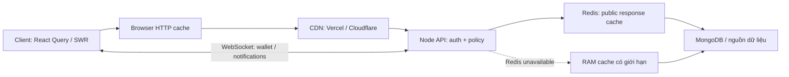

# Cache và đường truyền dữ liệu



Redis chỉ được Node truy cập. Trình duyệt tiếp tục gọi cùng origin `/api/*`;
Python vẫn chỉ được Node gọi. Request ghi, tài khoản, JOY và xác thực đi tới
API để kiểm tra quyền và xử lý bằng nguồn dữ liệu thật.

## Phần đã thực hiện trong mã nguồn

- `server/utils/cacheHelper.js` dùng Redis cho các caller hiện có: hồ sơ công
  khai theo slug/tên miền, dữ liệu portfolio, danh mục gói và bảng xếp hạng cờ.
  Chỉ đưa dữ liệu JSON công khai đã lọc vào helper. Mã đổi quà nằm riêng ở
  `GET /api/packages/admin` có `requireAdmin`, không vào cache công khai.
- Dữ liệu fresh theo TTL của caller (hiện 5 hoặc 60 giây); dữ liệu stale được
  trả ngay và làm mới nền. Hết 3 lần TTL, tối đa 5 phút, phải đọc nguồn thành
  công. Không trả dữ liệu cũ vô hạn khi MongoDB lỗi.
- Request cùng key trong một Node được gom chung. Redis chia sẻ kết quả giữa
  các Node; chưa có distributed lock nên một đợt cold miss có thể đọc MongoDB
  một lần trên mỗi instance. Chỉ thêm lock khi đo thấy tải DB cần nó.
- Kết nối Redis cache riêng có timeout 200 ms mỗi command, không xếp hàng lúc
  mất mạng và không phát lại command đang dở khi reconnect. Presence/realtime
  giữ kết nối hiện tại. RAM dự phòng tối đa 1000 key, có TTL và FIFO; đây là
  giới hạn số key, chưa phải giới hạn tổng byte.
- Khi Redis hoạt động, các lượt đọc không có request đang chạy dùng Redis làm
  nguồn cache chung. RAM giữ dữ liệu stale trong lúc refresh và làm dự phòng
  khi Redis mất kết nối. Reconnect xoá RAM và tách các lượt tải cũ đang chạy.
- Invalidation sau khi ghi dùng tombstone có thời hạn và Redis compare-and-set:
  lượt tải cũ không thể nạp lại bản đã bị xoá hoặc ghi đè bản mới. Xoá cache
  hồ sơ bao gồm slug và tên miền riêng; đổi slug xoá cả tên cũ lẫn tên mới.
- `cachePolicy` chạy trước các middleware khác. Response mặc định là
  `private, no-store`; lỗi, request ghi, request có Cookie/Authorization hoặc
  response Set-Cookie luôn bị chặn cache ở browser, Vercel và Cloudflare.
  Đuôi `.js`, `.png` trên đường dẫn API không còn tự mở cache công khai.
- API dùng Workbox `NetworkOnly`, vẫn hưởng HTTP cache theo header server.
  CacheStorage không còn lưu chung API cá nhân theo URL. Worker mới xoá ba
  cache API cũ khi activate. Cache assets/fonts và cache giao diện hiện có
  tiếp tục hoạt động. Thay đổi worker chỉ tới thiết bị sau build + deploy.

## Giới hạn nhất quán

Đây là cache cho dữ liệu công khai chấp nhận trễ, không phải kho dữ liệu giao
 dịch. Một request đang chạy trước khi ghi có thể nhận bản cũ. Nếu Redis lỗi
đúng lúc invalidation, ghi DB vẫn thành công; cache trên instance khác hoặc
Redis phục hồi có thể giữ bản cũ tới hết TTL. Không dùng helper cho số dư,
quyền truy cập, mã đổi quà hoặc quyết định thanh toán.

Xoá cache origin không purge bản CDN đang lưu. Các route public chính giữ
`max-age=0, s-maxage=60, stale-while-revalidate=120`; dữ liệu ở edge có thể
cũ thêm 180 giây so với bản origin đã nhận. Các TTL ở nhiều tầng có thể cộng
dồn. Muốn thu hồi nội dung ngay phải purge cả CDN; thông tin cần thu hồi ngay
không nên dùng policy này. Header origin không thay thế cấu hình bypass tại
edge, vì cache hit ở edge xảy ra trước khi Node nhận request.

## Cấu hình triển khai

1. Đặt `REDIS_URL` trong môi trường **Node**. Dùng Redis cùng vùng với Node,
   mạng riêng hoặc `rediss://` có TLS; không đưa URL/credential vào `VITE_*`.
   Namespace response là `hugo:response:v1:`. Dùng Redis/DB riêng cho mỗi môi
   trường. Không cần thêm thư viện hay dịch vụ Node thường trực mới.
2. Vercel phục vụ frontend và assets theo `vercel.json`. API proxy giữ header
   từ Node; không đặt cache công khai chung cho `/api/*`.
3. Cloudflare trước API: bypass cache với method ngoài GET/HEAD, request có
   Authorization hoặc Cookie; chỉ bật cache API cho allowlist GET công khai
   đã rà soát, ví dụ `/api/data`, `/api/packages`, `/api/bios/slug/*`,
   `/api/bios/by-domain/*`. Tôn trọng Origin Cache Control và TTL từ response.
   Không dùng Edge TTL override để bỏ qua `private`/`no-store`; không bật
   cache errors. Các rule bypass phải có hiệu lực cuối cùng theo thứ tự rule.
4. Purge cache API cũ khi triển khai lần đầu, nhất là `/api/packages` vì bản
   trước có thể chứa mã đổi quà. Bản worker mới tự xoá CacheStorage cũ khi
   activate; cache CDN cần purge tại nhà cung cấp.
5. Kiểm tra staging bằng hai tài khoản và cửa sổ ẩn danh: cookie/token luôn
   bypass; anonymous GET công khai mới có thể HIT. Xem `Age`, `CF-Cache-Status`
   hoặc `X-Vercel-Cache`. Các check local không chứng minh CDN đã cấu hình đúng.

Chưa thay đổi hạ tầng CDN/Redis production hay deploy từ tác vụ này.

## Kiểm chứng

```bash
node server/scripts/check-cache-headers.mjs
node server/scripts/check-response-cache.mjs
# Cần redis-server local; tự tạo Redis cô lập, không đọc dữ liệu production.
node server/scripts/check-response-cache.mjs --redis
npm run check:all
```

Check HTTP dùng middleware thật để kiểm cookie, token, Set-Cookie, lỗi, POST,
GET/HEAD công khai và đường dẫn giả đuôi tài nguyên. Check cache dùng helper
thật để kiểm single-flight, chia sẻ Redis, invalidation khi đang tải, SWR,
hết hạn cứng, lỗi nguồn, JSON Redis hỏng và Redis mất kết nối.

Tài liệu nhà cung cấp:
[Vercel CDN cache](https://vercel.com/docs/caching/cdn-cache),
[Cloudflare Origin Cache Control](https://developers.cloudflare.com/cache/concepts/cache-control/),
[ioredis connection options](https://redis.github.io/ioredis/interfaces/CommonRedisOptions.html).
