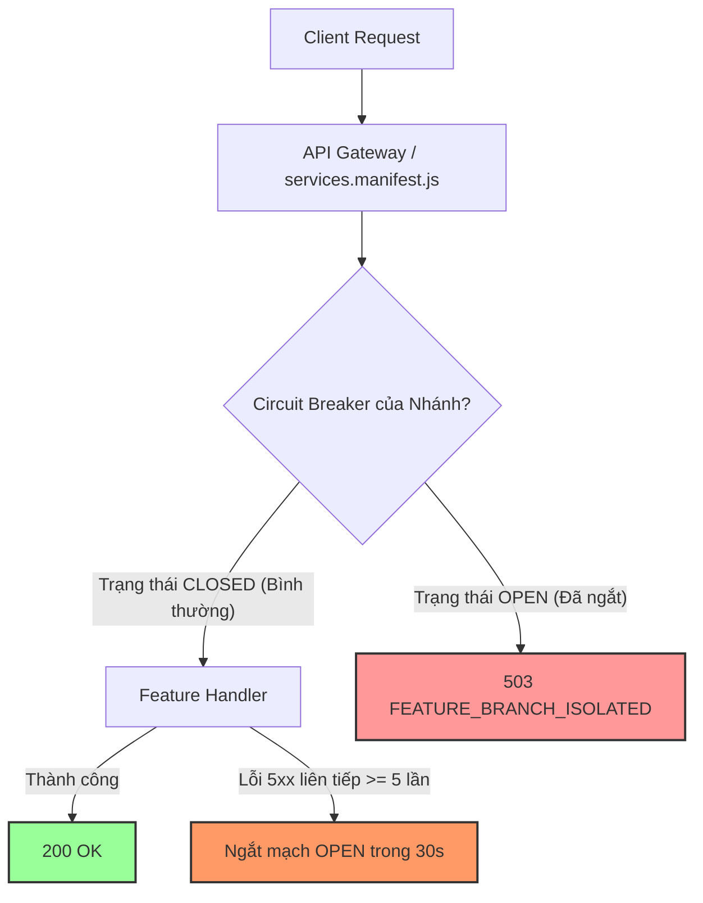

# KIẾN TRÚC BACKEND & CƠ CHẾ CÁCH LY NHÁNH TÍNH NĂNG (FEATURE FAULT ISOLATION)

Tài liệu hướng dẫn tổ chức mã nguồn, phân nhóm tính năng và cơ chế bảo vệ tự ngắt (Circuit Breaker) cho Hugo Studio Backend.

---

## 1. Vấn đề của cấu trúc cũ (Technical Layering)

Trước đây, mã nguồn backend được tổ chức theo tầng kỹ thuật phẳng:
- `routes/` (51 tệp): Chứa toàn bộ router của tất cả các tính năng từ Game, Cờ vua, Ví tiền, AI, Hồ sơ, Cửa hàng...
- `models/` (60 tệp): Chứa toàn bộ schemas NoSQL.
- `services/` (45 tệp): Chứa các logic nền.

**Hạn chế lớn**:
1. **Khó đọc, khó hiểu**: Khi muốn sửa một tính năng (ví dụ `Arcade` hay `Chess`), lập trình viên phải mở 4–5 thư mục khác nhau để tìm các file rời rạc.
2. **Nguy cơ lỗi chéo (Blast Radius)**: Một lỗi cú pháp, exception bất ngờ hoặc database nghẽn ở một tính năng phụ (như game 2048) có thể làm treo tiến trình Node.js, kéo theo toàn bộ các tính năng cốt lõi (như Đăng nhập, Ví JOY) bị ảnh hưởng.

---

## 2. Kiến trúc mới: Feature-Based Modules & Circuit Breaker

Hệ thống đã được bổ sung cơ chế **Fault Isolation (Cách ly sự cố)** và **Domain Modules (Gom nhóm theo tính năng)**:

```text
server/
├── modules/                         # 🌟 CÁC NHÁNH TÍNH NĂNG GOM CHUNG (FEATURE MODULES)
│   ├── arcade/                      # Trò chơi (2048, Caro, Survivor, Snake, Pinball, Scores)
│   ├── chess/                       # Cờ vua (Realtime WebSocket, ELO Ratings, Lịch sử đấu)
│   ├── joy/                         # Ví JOY (Chuyển tiền, Nợ JOYlater, Idempotency, Ledger)
│   ├── companion/                   # Trợ lý AI HugoPsy (Chat, Trị liệu, Ký ức dài hạn)
│   ├── auth/                        # Xác thực (Google, WebAuthn Passkeys, OAuth2)
│   └── store/                       # Cửa hàng tiện ích & Giỏ hàng
├── middleware/
│   └── featureCircuitBreaker.js     # 🛡️ BỘ NGẮT MẠCH & CÁCH LY LỖI TỪNG NHÁNH
├── services.manifest.js             # BẢN KHAI DỊCH VỤ TẬP TRUNG (GATEWAY MANIFEST)
└── server.js                        # Điểm khởi động máy chủ (Port 8099)
```

---

## 3. Cơ chế Tự Ngắt khi Lỗi (Circuit Breaker per Branch)

Tại [`services.manifest.js`](../services.manifest.js), mọi prefix dịch vụ khi mount vào Express đều được tự động bọc qua [`featureCircuitBreaker.js`](../middleware/featureCircuitBreaker.js):



### Nguyên lý hoạt động:
1. **Cô lập hoàn toàn (Isolation)**: Mỗi nhánh tính năng có một bộ đếm lỗi và trạng thái riêng biệt (`arcade`, `chess`, `joy`, `radio`...).
2. **Tự động ngắt khi sự cố**: Nếu một nhánh bị lỗi máy chủ hoặc database 5 lần liên tiếp:
   - Hệ thống tự động chuyển trạng thái của nhánh đó sang `OPEN` (ngắt mạch) trong 30 giây.
   - Các request tới nhánh đó lập tức nhận thông báo:
     ```json
     {
       "success": false,
       "error": {
         "code": "FEATURE_BRANCH_ISOLATED",
         "feature": "arcade",
         "message": "Tính năng arcade tạm thời được hệ thống tự ngắt để bảo vệ dữ liệu... Các tính năng khác vẫn dùng bình thường."
       }
     }
     ```
   - **Tất cả các nhánh khác (Ví tiền, Đăng nhập, Hồ sơ...) vẫn hoạt động bình thường 100%!**
3. **Tự phục hồi (Self-Healing)**: Sau 30 giây, nhánh chuyển sang trạng thái `HALF-OPEN` để thử nghiệm 1 request. Nếu thành công, nhánh tự động đóng mạch lại (`CLOSED`) và phục vụ bình thường.

---

## 4. Bảng Tra Cứu Tính Năng (Feature Directory Map)

| Nhánh Tính Năng | Thư mục Gom Nhóm | Mô tả Trọng Tâm |
| :--- | :--- | :--- |
| **Trò chơi Arcade** | `server/modules/arcade/` | Toàn bộ 5 trò chơi, tính thưởng JOY, kỷ lục, bảng xếp hạng. |
| **Cờ vua Realtime** | `server/modules/chess/` | Đấu cờ, WebSocket `/ws/chess`, tính điểm ELO, lịch sử ván cờ. |
| **Hệ sinh thái Ví JOY** | `server/modules/joy/` | Sổ cái `JoyLedger`, chuyển JOY, nợ `joyLater`, thẻ quà tặng, chống lặp `idempotency`. |
| **Trợ lý AI HugoPsy** | `server/modules/companion/` | Hội thoại trị liệu tâm lý, phân tích giấc ngủ, RAG vector. |
| **Danh tính & Xác thực** | `server/modules/auth/` | Đăng nhập Google, Passkey sinh trắc học WebAuthn, OAuth provider. |
| **Thương mại & Dịch vụ** | `server/modules/store/` | Giỏ hàng, mã giảm giá, cổng thanh toán PayOS. |

---

## 5. Quy tắc Phát triển Tính năng Mới

1. Viết code gom theo thư mục tính năng tại `server/modules/<ten-tinh-nang>/`.
2. Khai báo service tại [`services.manifest.js`](../services.manifest.js):
   ```javascript
   { id: "my-feature", prefix: "/api/my-feature", module: "./routes/myFeatureRoutes.js" }
   ```
3. Hệ thống sẽ **tự động trang bị Circuit Breaker** và cơ chế tự ngắt cách ly lỗi cho tính năng mới mà không cần cấu hình thêm bất kỳ middleware nào.
